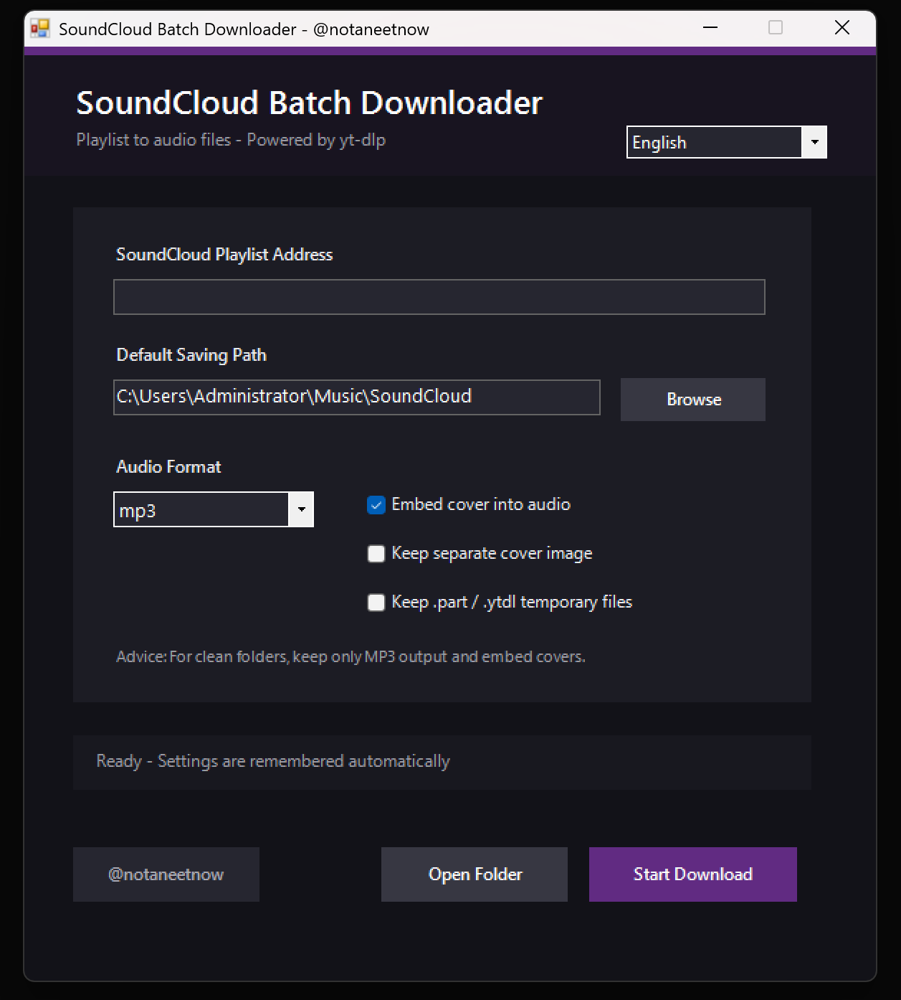

# SoundCloud Batch Downloader

A lightweight Windows GUI for downloading SoundCloud playlists using yt-dlp.
This release includes FFmpeg and yt-dlp binaries for convenience.

## Features

* Download entire SoundCloud playlists
* MP3 / M4A / FLAC / WAV output
* Embed cover artwork into audio files
* Optional thumbnail export
* Automatic settings saving
* English / 中文 / 日本語 interface
* Built-in FFmpeg support

## Requirements

Windows 10 / Windows 11 (MAC/LINUX will be capable in future updates)

No additional installation required.

## Usage

1. Launch `SoundCloudBatchDownloader.exe`
2. Paste a SoundCloud playlist URL
3. Choose output folder and format
4. Click **Start Download**

## Included Components

This package includes:

* yt-dlp
* FFmpeg
* FFprobe

All rights belong to their respective authors.

## Disclaimer

This project is not affiliated with SoundCloud.

Users are responsible for complying with all applicable laws, copyrights, and platform terms of service.

Only download content you own or have permission to download.

## License

See LICENSE file.
